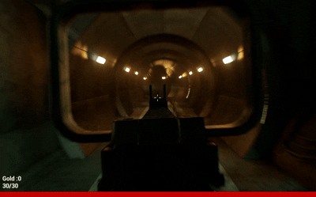

# 1인칭 FPS 로그라이크

## 시연 영상
[시연 영상 링크](https://www.youtube.com/watch?v=8vEVvKcFGWY)

## 프로젝트 소개

FPS 전투의 조작감과 로그라이트의 성장 및 선택 요소를 결합한 개인 프로젝트입니다.

플레이어는 전투를 통해 골드를 획득하고, 스테이지 종료 후 **일반 전투**, **엘리트 전투**, **상점** 중 하나를 선택하여 다음 스테이지로 진행합니다. 상점에서는 획득한 재화를 사용해 능력치를 강화할 수 있으며, 일정 스테이지를 돌파하면 보스전에 도전하게 됩니다.

---

## 개발 정보

| 항목    | 내용                           |
| ----- | ---------------------------- |
| 개발 기간 | 2026.03.23 ~ 2026.04.06 (2주) |
| 개발 인원 | 개인                           |
| 엔진    | Unreal Engine 5              |
| 개발 언어 | Blueprint                    |
| 장르    | 1인칭 FPS 로그라이크          |
| 플랫폼   | PC                           |

---

## 주요 기능

### 플레이어 액션 시스템

* 1인칭 시점 이동
* 달리기
* 사격 및 연사
* 회피(구르기)
* 액션 상태 제어

### 로그라이크 진행 구조

* 일반 전투 선택
* 엘리트 전투 선택
* 상점 선택
* 스테이지 진행도 관리
* 보스전 진입

### 성장 시스템

* 공격력 강화
* 최대 체력 증가
* 최대 장탄 수 증가
* 체력 회복

---

## 프로젝트 구조

### GameInstance

레벨 전환 시에도 유지되어야 하는 게임 데이터를 관리합니다.

* 플레이어 재화
* 누적 스탯
* 현재 진행도

### Player Character

플레이어의 핵심 동작을 담당합니다.

* 이동
* 사격
* 회피
* 상태 관리

### GameMode

맵에 따라 입력 방식을 관리합니다.

* 메뉴 UI 모드
* 인게임 플레이 모드

---

## 🔧 구현 내용

### 액션 상태 관리 시스템

플레이어의 행동 상태를 관리하여 액션 간 충돌을 방지하였습니다.

* 달리기 중 사격 제한
* 사격 중 회피 시 즉시 행동 전환
* 회피 시 사격 중단
* 연사 로직 중복 실행 방지

### 스테이지 분기 시스템

전투 종료 후 플레이어가 다음 진행 경로를 선택할 수 있도록 구현하였습니다.

* 일반 전투
* 엘리트 전투
* 상점

선택에 따라 성장 방식과 플레이 경험이 달라집니다.

### 상점 시스템

획득한 골드를 사용하여 캐릭터를 강화할 수 있습니다.

* 공격력 증가
* 체력 증가
* 장탄 수 증가
* 체력 회복

---

## 트러블 슈팅

### Mixamo 루트 모션 문제

#### 문제

Mixamo 애니메이션 적용 시 구르기 동작이 정상적으로 이동하지 않는 문제가 발생했습니다.

#### 해결

Mixamo Converter를 활용하여 Root Bone을 추가하고 Unreal Engine 환경에 맞게 애니메이션 데이터를 변환하였습니다.

#### 결과

루트 모션 기반 회피 동작이 정상적으로 작동하도록 개선하였습니다.

---

### 사격-회피 상태 충돌

#### 문제

연사 중 회피를 사용하면 총알이 계속 발사되는 문제가 발생했습니다.

#### 해결

회피 시작 시 사격 종료 로직과 타이머 정리 로직을 함께 실행하도록 수정하였습니다.

#### 결과

행동 전환 시 상태 충돌 없이 안정적으로 동작하도록 개선하였습니다.

---

## 프로젝트 결과

| 구현 요소   | 내용                |
| ------- | ----------------- |
| 플레이어 액션 | 이동, 달리기, 사격, 회피   |
| 스테이지 분기 | 일반 전투, 엘리트 전투, 상점 |
| 성장 시스템  | 체력, 공격력, 장탄 수     |
| 보스 콘텐츠  | 보스전               |
| 데이터 관리  | 진행도 및 스탯 유지       |

---

## 배운 점

* 액션 게임에서 상태 관리의 중요성
* Blueprint 기반 시스템 설계 경험
* 루트 모션 애니메이션 파이프라인 이해
* 로그라이트 구조 설계 경험
* GameInstance를 활용한 데이터 관리 경험

---
